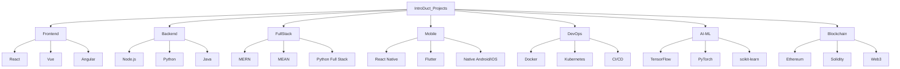

# 🚀 IntroDuct_Projects: Your Gateway to Tech Career Success

Welcome to IntroDuct_Projects - Your comprehensive guide to kickstarting your tech career! This repository is carefully curated to provide detailed project ideas and learning paths across various technology domains. Whether you're a beginner or looking to switch careers, we've got you covered! 

## 🗺️ Technology Paths

## 📚 Directory Structure

Each technology path has its own directory with:
- Detailed project ideas
- Step-by-step tutorials
- Best practices
- Resource links
- Career guidance

### Quick Links
- [Frontend Development](./Frontend/README.md)
- [Backend Development](./Backend/README.md)
- [Full Stack Development](./FullStack/README.md)
- [Mobile Development](./Mobile/README.md)
- [DevOps & Cloud](./DevOps/README.md)
- [AI & Machine Learning](./AI-ML/README.md)
- [Blockchain Development](./Blockchain/README.md)

## 🌟 Features

- 📝 Detailed project requirements and specifications
- 🛠️ Step-by-step implementation guides
- 📈 Progressive difficulty levels
- 🔗 Curated learning resources
- 💡 Best practices and tips
- 🎯 Career path guidance
- 🤝 Community contributions welcome

## 🤔 How to Use This Repository

1. Choose your technology path from the directories above
2. Start with the README in that directory
3. Follow the progressive project path from beginner to advanced
4. Use the provided resources to enhance your learning
5. Contribute back to help others!

## 🤝 Contributing

We welcome contributions! Please see our [Contributing Guidelines](CONTRIBUTING.md) for details.

## 📜 License

This project is licensed under the MIT License - see the [LICENSE](LICENSE) file for details.

## ⭐ Show Your Support

If you find this repository helpful, please give it a star! It helps others discover these resources.

## 📞 Contact

- Creator: [MananVyasDev](https://github.com/MananVyasDev)
- Email: mananvyas.dev@gmail.com
- LinkedIn: [Manan Vyas](https://www.linkedin.com/in/mananvyas0110)

---

Made with ❤️ by the developer community, for the developer community!
